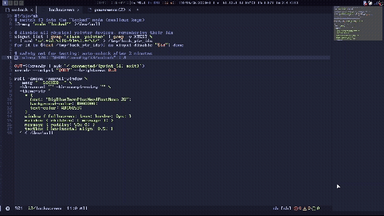

# i3 rofi lockscreen

A minimal, fullscreen "LOCKED" screen for [i3wm](https://i3wm.org/), built from `rofi`, an i3 binding mode, and `xinput`. While active, the screen dims, the keyboard and mouse are swallowed, and a single combo key (`$mod+p`) brings everything back. You can change the binding to your liking. 

> **This is not a security lock.** There is no password. It is a "hands-off" screen for testing, demos, or keeping a cat off the keyboard. If you need real protection, use something else that has sudo. 

## How it works

| Piece | What it does |
| --- | --- |
| `lockscreen` | Switches i3 into the `locked` mode, disables pointer devices with `xinput`, dims the screen, hides the cursor, and shows a fullscreen rofi message. |
| `unlock` | Re-enables pointers, restores brightness, kills rofi and `unclutter`, and returns i3 to the `default` mode. |
| `locked` mode (i3 config) | Binds every keycode to `nop` so keys do nothing, except `$mod+p`, which runs `unlock`. |
| `for_window` rule | Makes the rofi window fullscreen so it covers the bar. |

## Requirements

- i3wm
- `rofi`
- `xinput` (package `xorg-xinput` / `xinput`)
- `unclutter` (hides the cursor), or `xdotool` as an alternative
- Dimming, pick one:
  - `xrandr`: software dimming, works on any display, usually already installed
  - `brightnessctl`: real backlight control (laptops)
- A Nerd Font if you want the same look (the example uses `BigBlueTermPlusNerdFontMono`)

## Install

Put the scripts in `~/.config/i3/` and make them executable:

```sh
cp lockscreen unlock ~/.config/i3/
chmod +x ~/.config/i3/lockscreen ~/.config/i3/unlock
```

### 1. `~/.config/i3/lockscreen`

```sh
#!/bin/sh

# switch i3 into the "locked" mode (swallows keys)
i3-msg 'mode "locked"' >/dev/null

# disable all physical pointer devices, remembering their ids
xinput list | grep 'slave  pointer' | grep -v XTEST \
  | sed 's/.*id=\([0-9]*\).*/\1/' > /tmp/lock_ptr_ids
for id in $(cat /tmp/lock_ptr_ids); do xinput disable "$id"; done

# hide the cursor
unclutter --timeout 0 &

# dim the screen (xrandr, software dimming)
OUT=$(xrandr | awk '/ connected/{print $1; exit}')
xrandr --output "$OUT" --brightness 0.3

# safety net for testing: auto-unlock after 2 minutes
( sleep 120; "$HOME/.config/i3/unlock" ) &

rofi -dmenu -normal-window -name lockscreen \
  -mesg "--LOCKED--" \
  -kb-cancel "" -kb-accept-entry "" \
  -theme-str '
    * {
      font: "BigBlueTermPlusNerdFontMono 24";
      background-color: #000000;
      text-color: #DC0153;
    }
    window { fullscreen: true; border: 0px; }
    mainbox { children: [ message ]; }
    message { expand: true; padding: 0; }
    textbox { expand: true; vertical-align: 0.5; horizontal-align: 0.5; }
  ' < /dev/null
```

### 2. `~/.config/i3/unlock`

```sh
#!/bin/sh
for id in $(cat /tmp/lock_ptr_ids 2>/dev/null); do xinput enable "$id"; done
pkill unclutter
pkill -x rofi

OUT=$(xrandr | awk '/ connected/{print $1; exit}')
xrandr --output "$OUT" --brightness 1.0

i3-msg 'mode "default"' >/dev/null
```

### 3. `~/.config/i3/config`

Add the trigger binding and the fullscreen rule:

```
#LOCKSCREEN
bindsym $mod+Escape exec --no-startup-id $HOME/.config/i3/lockscreen
for_window [instance="lockscreen"] fullscreen enable
```

Then generate the key-swallowing mode and append it to your config:

```sh
{
  echo ''
  echo '# --- lock mode ---'
  echo 'mode "locked" {'
  echo '    bindsym $mod+p exec --no-startup-id $HOME/.config/i3/unlock, mode "default"'
  for i in $(seq 8 255); do echo "    bindcode $i nop"; done
  echo '}'
} >> ~/.config/i3/config
```

Make sure `$mod+p` is not bound anywhere else at the top level, then validate and reload:

```sh
i3 -C -c ~/.config/i3/config
i3-msg reload
```
or 

```sh
mod+shift+r
```

## Usage

| Action | How |
| --- | --- |
| Lock | `$mod+Escape` (change the binding to taste) |
| Unlock | `$mod+p` |

## Customizing

- **Text, color, font size:** edit the `-mesg` string and the `*` block in the `-theme-str`.
- **Vertical position:** adjust `message { padding: ...; }` if the text is not where you want it.
- **Brightness level:** change `--brightness 0.3` (software) or use `brightnessctl -s set 10%` in `lockscreen` and `brightnessctl -r` in `unlock` (real backlight).
- **Cursor hiding:** older `unclutter` builds use `unclutter -idle 0 -root &` instead of `--timeout 0`. Or replace the line with `xdotool mousemove 0 0`.
- **Auto-unlock timer:** the 2-minute failsafe is meant for testing. Remove the `( sleep 120; ... ) &` line once you trust your setup.

## Limitations

- Only keys pressed **without modifiers** are swallowed. Combos that include `$mod`, `Shift`, or `Ctrl` can still trigger other i3 bindings. Extend the `bindcode` loop with modifier variants if that matters to you.
- Software dimming (`xrandr`) only darkens the picture; it does not reduce backlight power. The generated commands dim the first connected output only, so loop over `xrandr` outputs for multi-monitor setups.
- This does not stop anyone with access to a TTY or SSH from using the machine.

## Troubleshooting

**Stuck locked?** Switch to a TTY (`Ctrl+Alt+F2`) and run:

```sh
DISPLAY=:0 ~/.config/i3/unlock
```

If the mouse is still dead, list devices and re-enable them manually:

```sh
DISPLAY=:0 xinput list
DISPLAY=:0 xinput enable <id>
```

**The lock window does not cover the bar:** check that the `for_window` rule matches. Run `xprop WM_CLASS` and click the lock window; the instance name must be `lockscreen`.

**i3 reports a config error after reload:** run `i3 -C -c ~/.config/i3/config` to see the offending line.

If you still have issues, please submit an issue. I will resolve it and get to you in a timely manner. 
